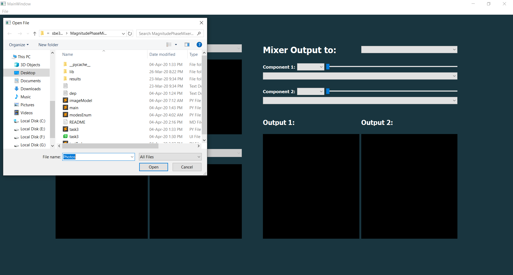
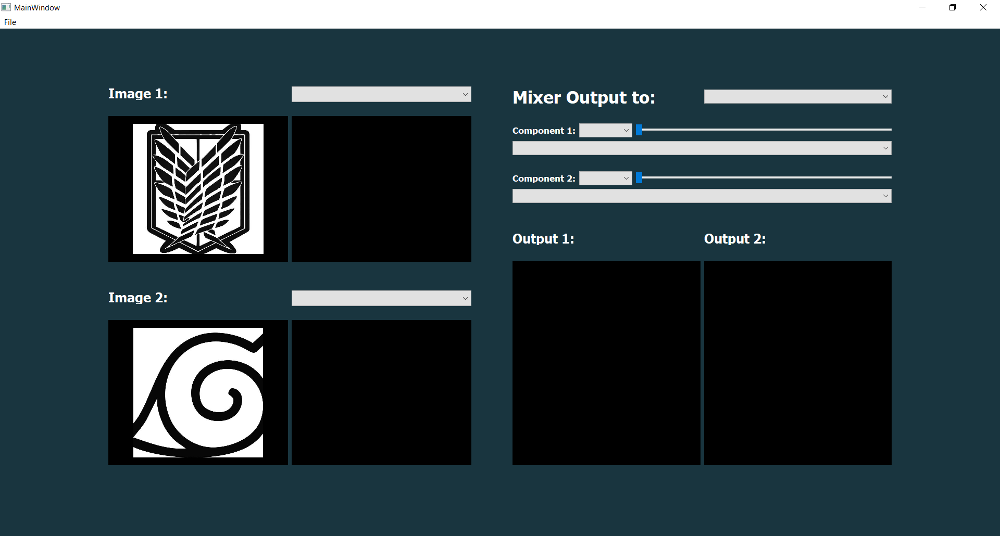
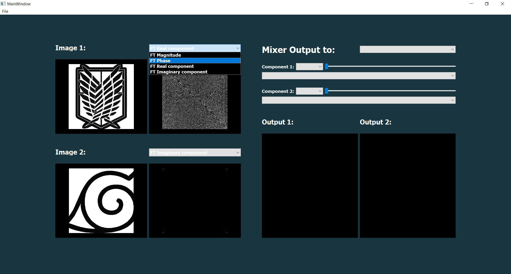
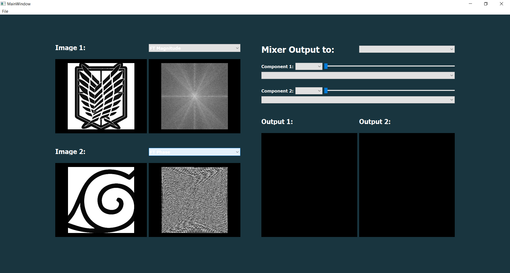
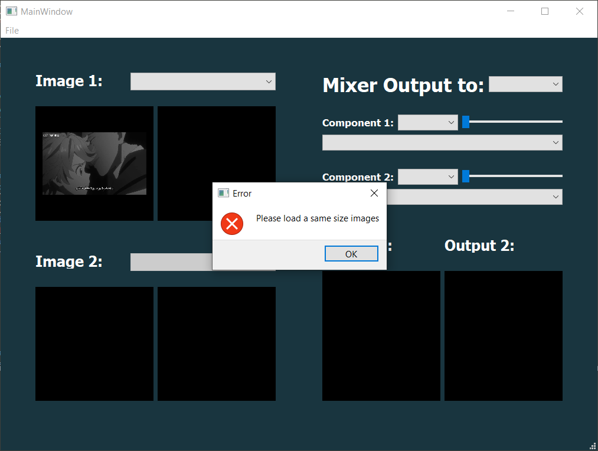
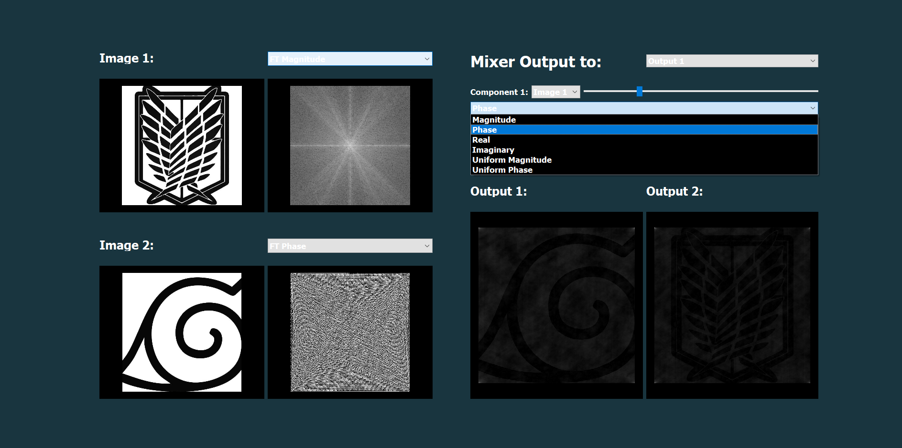

### **Name: Sara Mohamed Ali**
### **ID: Sec:1** 
## **B.N:36**
***
## **MixerTemplate**

At first, user will choose an image to be show from menue bar "load"
***

he can choose 2 images and show it's Magnitude,
phase, imaginary or real component.
***

***

***

but the 2nd image should the the same size as the first image in ordered to be mixed or there will be an error message asked the user to choose same size images.

***
and if he want to load another two images a message will be appear to check if he want to clear this 2 imeges and load new ones or not.
***
After choosing the second image, you can use the mixer like that:

***

In component 1: you can 1st  image  to be mix and choose the component you want to be applied on \
In component 2: you also can choose each of the two images to be displayed and choose the component you want to be applied on it and changeing the mixing ratio between the 2 components using the sliders.
Finally, you can choose where you want to be display the output  (Output1 OR Output2) 
